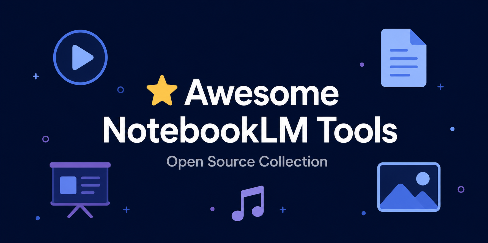

# Awesome NotebookLM Ferramentas 

> Uma coleção curada de ferramentas, scripts e recursos para Google NotebookLM — remoção de marcas d'água, processamento de áudio, engenharia de prompts e mais.

  

  <strong>🌐 <a href="https://notebooklmremover.org">Experimentar a ferramenta online →</a></strong> — Grátis, processamento local no navegador, sem upload

  <a href="README.md">English</a> · <a href="README_zh-CN.md">中文</a> · <a href="README_ja.md">日本語</a> · <a href="README_ko.md">한국어</a> · <a href="README_es.md">Español</a> · <a href="README_fr.md">Français</a> · <a href="README_de.md">Deutsch</a> · <a href="README_ru.md">Русский</a>

---

## Por que isso existe

O Google NotebookLM é uma ferramenta de pesquisa com IA incrível, mas a versão gratuita adiciona marcas d'água a todas as exportações. A opção oficial para removê-las (NotebookLM Ultra) custa **US$ 250/mês**.

Este repositório reúne ferramentas **gratuitas, de código aberto e com foco em privacidade**.

## 🌐 Ferramentas online

| Ferramenta | Formatos | Privacidade | Grátis |
|------------|----------|-------------|--------|
| **[NotebookLM Remover](https://notebooklmremover.org)** | Vídeo, PDF, PPTX, Infográfico, Imagem Gemini, Áudio, Metadados | 100% local no navegador | ✅ |

> 💡 **[NotebookLM Remover](https://notebooklmremover.org)** é a opção mais completa — suporta 8 tipos de formato e funciona inteiramente no navegador com WebAssembly. Seus arquivos nunca saem do seu dispositivo.

## 📊 Grátis vs Ultra vs NotebookLM Remover

| Recurso | Grátis | Ultra (US$ 250/mês) | NotebookLM Remover |
|---------|--------|---------------------|-------------------|
| Marca d'água em slides | ✅ Sim | ❌ Não | ❌ Removida grátis |
| Marca d'água em vídeo | ✅ Sim | ❌ Não | ❌ Removida grátis |
| Privacidade | Lado do servidor | Lado do servidor | 100% local no navegador |
| Custo | Grátis | US$ 250/mês | Grátis |

---

## Licença

